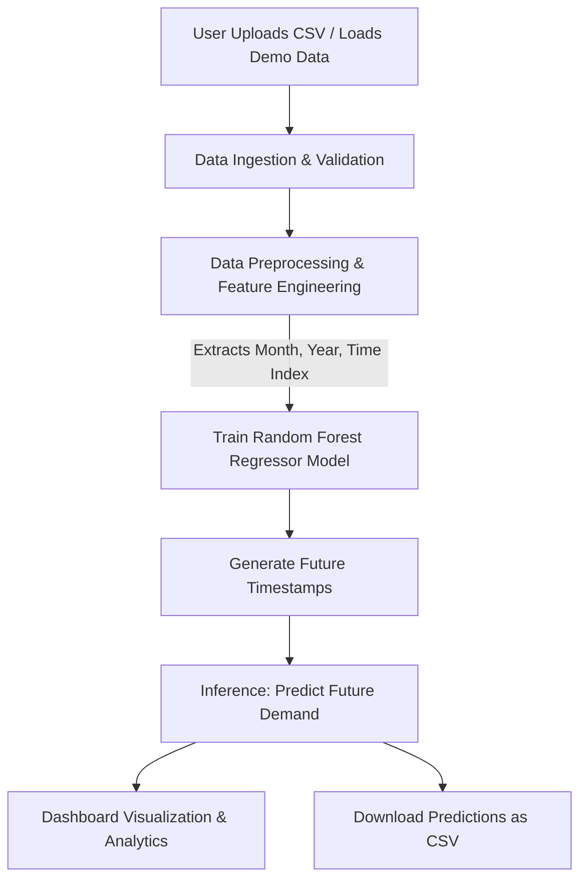

# Product Demand Forecasting System

A professional, machine learning-powered web application designed to forecast future product demand based on historical sales data. Built with Python and Streamlit, the application features a clean, high-performance developer dashboard and utilizes a Random Forest Regressor to provide accurate time-series demand predictions.

## Key Features

- **Executive Dashboard**: Unified overview featuring 5 KPI metrics (Dataset status, Total records, Forecast period, Model type, and Status), interactive charts, and highlights.
- **Dynamic Data Ingestion**: Custom CSV file upload interface alongside a fallback feature to load a default demo dataset instantly.
- **Interactive Forecasting**: Category-specific prediction tools with an adjustable monthly horizon slider (1 to 12 months) and tabular forecast outputs.
- **Sales Analytics**: Deep dive insights including total sales breakdowns and ranking of the top 10 product categories.
- **Tabular Data Preview**: Interactive data explorer to filter, view, and inspect raw historical records.
- **Export Capabilities**: Generate printable summaries and export forecasted demand lists directly as CSV files.
- **Premium Interface**: A clean, modern light-themed UI utilizing custom CSS layouts, sidebar navigation, and material vector icons.

## Tech Stack

- **Frontend Framework**: Streamlit
- **Machine Learning**: Scikit-Learn (Random Forest Regressor)
- **Data Manipulation**: Pandas, NumPy
- **Data Visualization**: Matplotlib
- **Typography & Styling**: Google Fonts (Outfit), Custom CSS

## Installation and Setup

### Prerequisites

Ensure you have Python 3.9+ installed on your system.

### 1. Clone the Repository

```bash
git clone https://github.com/vasanth642/Product-Demand-Forcast.git
cd Product-Demand-Forcast
```

### 2. Install Dependencies

Install the required Python libraries using pip:

```bash
pip install -r requirements.txt
```

### 3. Run the Application

Start the Streamlit server locally:

```bash
streamlit run app.py
```

The application will open automatically in your browser at `http://localhost:8501`.

## File Structure

```text
Product-Demand-Forcast/
├── app.py                     # Main Streamlit application and layout
├── requirements.txt           # Python package dependencies
├── monthly_store_sales.csv    # Demo sales dataset
└── README.md                  # Project documentation
```

## System Architecture & Data Flow

The diagram below details the end-to-end data pipeline from importing raw historical sales data to generating and downloading predicted demand values.



### Stage-by-Stage Description

1. **Data Ingestion & Validation**
   - The user imports sales records through the file uploader or uses the pre-configured fallback demo dataset (`monthly_store_sales.csv`).
   - The system validates that the dataset contains the required schema: `Month` (Date), `family` (String/Product Type), and `sales` (Numeric/Volume).

2. **Preprocessing & Feature Engineering**
   - The system parses raw date strings into Datetime objects and chronologically sorts the records.
   - For the selected product category, the system generates time-series features:
     - `month_num` (Extracts calendar month 1-12 to capture seasonality).
     - `year` (Extracts calendar year to track long-term trend progression).
     - `time_index` (A sequential index representing elapsed time periods).

3. **Model Training**
   - A Scikit-Learn `RandomForestRegressor` (with 200 estimators) is trained using the engineered features (`time_index`, `month_num`, `year`) as inputs to fit target `sales` data.
   - The training step utilizes Streamlit's resource-caching system (`@st.cache_resource`) to prevent redundant model fitting when switching views.

4. **Inference & Prediction**
   - The system builds a future feature matrix based on the selected forecasting horizon (e.g. 6 months).
   - The trained model performs inference to predict future monthly demand numbers.

5. **Visualization & Export**
   - Visualizations are rendered as clean, high-contrast trend charts using styled Matplotlib figures.
   - Users can filter predictions, review metrics, preview underlying source metadata, and download predictions as a standardized CSV report.

